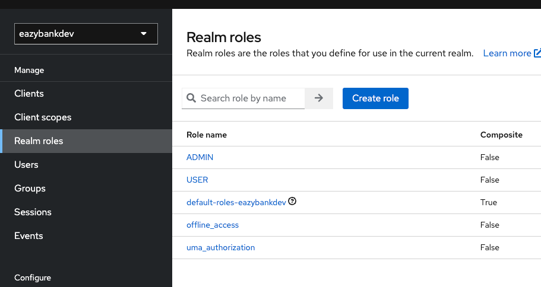
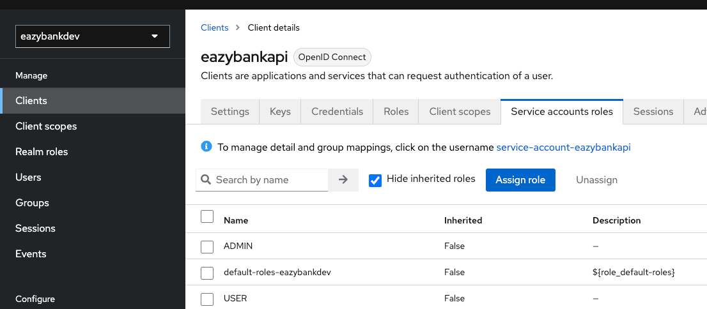
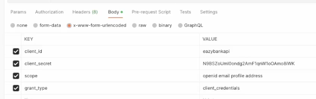

## Subir servidor keycloak 
win
bin\kc.bat start-dev --http-port 8180
bin\kc.sh start-dev --http-port <number-port>
#### Lista as urls mais importantes para acessar
http://localhost:8180/realms/eazybankdev/.well-known/openid-configuration

#### Criar Roles e vincular Clients



#### Vincular as Roles criadas ao cliente




## API TO API 
#### Access_token


```
curl --location 'http://localhost:8180/realms/eazybankdev/protocol/openid-connect/token' \
--header 'Content-Type: application/x-www-form-urlencoded' \
--data-urlencode 'client_id=eazybankapi' \
--data-urlencode 'client_secret=6MRpLPSCca0GgZffmRICEc1JiNtJz03j' \
--data-urlencode 'scope=openid email profile address' \
--data-urlencode 'grant_type=client_credentials'
```


## END TO USER 
#### Passos para gerar o token quando utilizamos o authorization code grant type flow


### No browser inserir essa url
http://localhost:8180/realms/eazybankdev/protocol/openid-connect/auth?client_id=eazybankclient&response_type=code&scope=openid&redirect_uri=http://localhost:7080/sample&state=wewewe

Será redirecionado para redirect_url configurada.
Copiar o code que vem como parametro na url exemplo: ?code=xyz

### Com código copiado , inserir na requisição: 
http://localhost:8180/realms/eazybankdev/protocol/openid-connect/token
a propriedade 'code' o value copiado exemplo: code->xyz

### Na requisição ao recurso
Passar no Header a prop Authorization Bearer 'tokenGerado'
